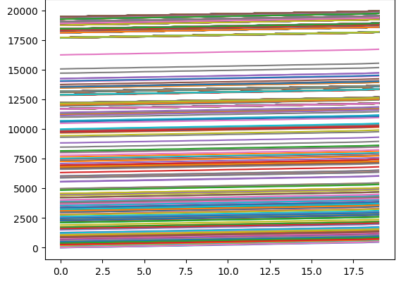
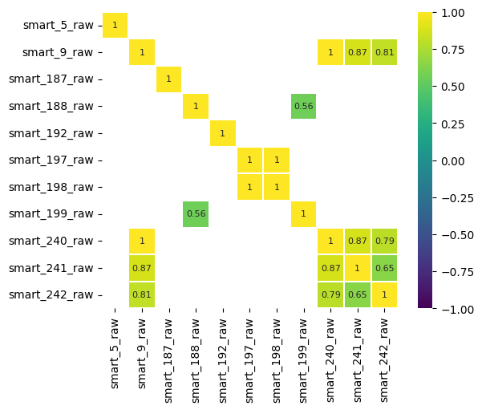

# hdd_failure_prediction

## Инструкция по запуску предобученной модели

Предварительные действия:
* запустить Docker
* иметь установленную python библиотеку *requests*
* записать ненормированные S.M.A.R.T показатели одного диска в файл *data.txt*
  - значения разделены пробелом
  - дробная часть отделена точкой

Действия для получения результата (Windows):
1. клонировать репозиторий ```git clone https://github.com/ExtremCode/hhd_failure_prediction.git```
2. перейти в папку *microservice* ```cd microservice```
3. выполнить команду  ```docker build -t microservice .```
4. запустить контейнер с моделью ```docker run -d -p 5000:5000 microservice```
5. выполнить ```cd ..```
6. получить прогноз с помощью команды ```python test_model_predict.py```

## Введение

С увеличением объемов данных и ростом зависимости бизнеса от информационных технологий, надежность хранения информации становится критически важной. Жесткие диски (HDD) остаются основным средством хранения данных, однако их выход из строя может привести к значительным потерям. Одним из перспективных подходов к предсказанию отказов жестких дисков является анализ S.M.A.R.T (Self-Monitoring, Analysis, and Reporting Technology) [1] показателей, которые предоставляют информацию о состоянии устройства и его производительности. Актуальность данной задачи обусловлена необходимостью разработки более эффективных алгоритмов, способных на ранних стадиях выявлять потенциальные проблемы, что позволит минимизировать риски потери данных и снизить затраты на обслуживание. В данной работе рассматриваются современные методы анализа SMART показателей и их применение для предсказания выхода из строя жестких дисков.

## Постановка задачи

Учитывая данные мониторинга состояния диска S.M.A.R.T и информацию о неисправностях, необходимо определить, выйдет ли из строя каждый диск в течение следующих 30 дней. Качество классификации оценивается с помощью метрики *AUC ROC* (англ. Area Under the Receiver Operating Characteristic Curve).

## Предварительный анализ данных

Предоставленные данные содержат ненормированные значения S.M.A.R.T показателей жестких дисков модели Seagate ST14000NM001G. Общее число записей 7320142. Частота дискретизации измерений составляет 1 день. В случае выхода из строя диска в его последнем дне в столбце `failure` стоит 1. Зафиксированное число дней работы дисков составляет от 1 до 828. Отсутсвуют пропущенные значения и дубликаты. Все признаки представлены в таблице 1.

Таблица 1 – Названия признаков и типы данных
 Номер |  Признак  |   Тип данных     
--- | ------     |     -----         
 0  | date          |  datetime64
 1  | serial_number  | str   
 2  | model           | str      
 3  | capacity_bytes  | int64         
 4  | failure        | int64         
 5  | smart_5_raw    | float64       
 6  | smart_9_raw    | float64       
 7  | smart_187_raw  | float64       
 8  | smart_188_raw  | float64       
 9  | smart_192_raw  | float64       
 10 | smart_197_raw  | float64       
 11 | smart_198_raw  | float64       
 12 | smart_199_raw  | float64       
 13 | smart_240_raw  | float64       
 14 | smart_241_raw  | float64       
 15 | smart_242_raw  | float64

Признаки `capacity_bytes` и `model` имеют только одно уникальное значение, в дальнейшем они не будут учитываться.

Число вышедших из строя жестких дисков составляет 172. Это свидетельствует о дисбалансе классов, который объясняется тем, что выход из строя не является частой и обычной ситуацией. Минимальное число дней, которое проработал диск, вышедший из строя – 12, 25-ый процентиль составляет 306 дней.

## Преобразование данных и новые признаки

Для построения обучающего набора данных были выбраны последние 41 день работы каждого диска. Из-за этого в набор не вошли 16 дисков. Для дисков, вышедших из строя, во всех строках признак `failure` назначался равным 1.

Временные ряды первых 20 дней из 41 в основном представляют из себя линейные функции с близкой к 0 производной на всем промежутке, рисунок 1, что затрудняет анализ признаков.



Рис. 1 – значения `smart_9_raw` в первые 20 дней из 41 для дисков, не вышедших из строя

На основе этих данных отдельно для каждого диска вычислялись новые признаки для каждого S.M.A.R.T показателя:
* среднее по 5, 7 и 10 дням экспоненциально взвешенных абсолютных разниц между следующим и предыдущим уровнями ряда (`..._roll_5`, `..._roll_7`, `..._roll_10`)
* сдвиг значений ряда из прошлого в будущее (лаг) на 3, 5, 7 и 10 дней (`..._lag_3`, `..._lag_5`, `..._lag_7`, `..._lag_10`).

Были добавлены признаки на основе физического значения S.M.A.R.T показателей:
* деление `smart_197_raw` на `smart_241_raw` (`smart_197_div_241`)
* деление `smart_198_raw` на `smart_241_raw` (`smart_198_div_241`)
* деление кумулятивного значения `smart_192_raw` на `smart_241_raw` (`smart_192cumul_div_9`)
* деление `smart_240_raw` на `smart_9_raw` (`smart_240_div_9`)
* деление `smart_242_raw` на `smart_241_raw` (`smart_242_div_241`)

Удалялись строки, содержащие хотя бы один пропущенный элемент в новых признаках. Таким образом был составлен набор данных, включающий 31 день измерений для каждого диска. Так как показатели имеют разные дни записи, то для каждого диска был проставлен номер дня, начиная с 1. Этот номер позволяет создать универсальную общую временную шкалу.

## Выбор предпочтительных признаков

Выбор признаков осуществляся на основе:
* статистических тестов
* на основании результатов похожих работ [2]–[5]
* используя свойства метрик L1 и L2 в обучении различных моделей

### Выбор по статистическим данным

Для определения информативных признаков были ипользованы критические значения теста Фишера и взаимной информации. Чем выше величина, тем более значимым является признак. Исходя из этого, были выбраны признаки, имеющие нормированные критические значения теста Фишера или взаимной информации больше 0,7.

Также имеется высокая корреляция `smart_198_raw` с `smart_197_raw`, аналогично `smart_240_raw` с `smart_9_raw`, `smart_241_raw` и `smart_242_raw`, рисунок 2.



Рис. 2 – Матрица корреляций исходных признаков

Соответственно, был рассмотрен вариант удаления признаков, связанных с `smart_240_raw` и `smart_198_raw`.

### Выбор на основании схожих работ

При решении аналогичной задачи [2] отмечена информативность признаков `smart_5_raw`, `smart_187_raw`, `smart_188_raw`, `smart_197_raw` и `smart_198_raw`.

### Выбор, используя обученные модели

Для выбора признаков производилось обучение логистической регрессии с использованием одновременно регуляризаций L1 и L2. Наиболее предпочтительные признаки имели ненулевые коэффициенты в модели.

Также была обучена модель градиентного бустинга над решающими деревьями с использованием регуляризации L1. На основе построенной модели были выбраны 4 группы признаков, каждая из которых составляет треть от общего числа всех признаков:
* участвовали в наибольшем числе разбиений ( `xgb_weight30`)
* привнесли наибольший средний прирост информации (`xgb_gain30`)
* привнесли наибольший суммарный прирост информации (`xgb_total_gain30`)
* участвовали при разделении наибольшего среднего количества примеров (`xgb_cover30`)

## Уменьшение размерности

Уменьшение размерности производилось с помощью выделения 20 главных компонент, используя анализ главных компонент, факторный анализ и матричную факторизацию.

## Балансировка классов

Рассматривались различные способы балансировки классов, такие как:
* SMOTE
* KMeansSMOTE
* ADASYN
* использование весовых коэффициентов

## Обучение и валидация моделей

Основываясь на публикациях [6]–[9], были применены модели:
* градиентный бустинг над решающими деревьями (XGBClassifier)
* случайный лес (RandomForest)
* изолирующий лес (IsolationForest)
* сбалансированный случайный лес (BalancedRandomForest)
* блендинг моделей (Blending)

Все данные делились на 3 части: тренировочную (60%), валидационную (20%) и тестовую (20%). Тренировочная выборка затем делилась на обучающую и проверочную в соотношении 80:20. Для каждой модели подбирался предпочтительный способ балансировки классов и набор признаков. Значения метрики *AUC ROC* обученных на обучающей выборке моделей для предсказаний валидационной выборки представлены в таблице 2.

Таблица 2 – Валидационное значение метрики *AUC ROC* различных моделей
Название | *AUC ROC*
--- | ---
XGBClassifier | 0,99852
RandomForest | 0,99515
IsolationForest | 0,96976
BalancedRandomForest | 0,99429
Blending | 0,99648

Исходя из рассмотрения таблицы 2, в качестве лучшей модели выбран градиентный бустинг с использование ADASYN и признаков: `smart_5_raw`, `smart_9_raw`, `smart_187_raw`, `smart_188_raw` `smart_192_raw`, `smart_197_raw`, `smart_198_raw`, `smart_199_raw`,
`smart_240_raw`, `smart_241_raw`, `smart_242_raw`, `smart_192cumul_div_9`,
`smart_240_div_9`, `smart_197_div_241`, `smart_198_div_241`,
`smart_242_div_241`. Значение метрики обученой модели при классификации тестовой выборки составляет 0,99783. Значение точности (Precision), полноты (Recall) и меры F1 для каждого класса приведены в таблице 3.

Таблица 3 – Значения различных показателей качества классификации для каждого класса
Класс | Точность | Полнота | F1 мера | Число записей
--- | --- | --- | --- | --- |
Работает | 1,00 | 1,00 | 1,00 | 66588 |
Вышел из строя | 0,90 | 0,97 | 0,94 | 1061 |

## Заключение

Были рассмотрены различные подходы к определению выхода из строя жестких дисков. Наилучший результат показала модель градиентного бустинга над решающими деревьями. Полученные результаты дают решение поставленной задачи.

## Список использованных источников
[1] S.M.A.R.T. [Электронный ресурс]. – Режим доступа: https://ru.wikipedia.org/wiki/S.M.A.R.T. (дата обращения: 20.12.2024)

[2] KarthikNA. Prediction of Hard Drive Failure [Электронный ресурс]. – Режим доступа: https://github.com/KarthikNA/Prediction-of-Hard-Drive-Failure (дата обращения:  20.12.2024)

[3] Tianchi. Информация о конкурсе [Электронный ресурс]. – Режим доступа: https://tianchi.aliyun.com/competition/entrance/231775/information (дата обращения: 20.12.2024)

[4] Harish Kumar. HDD Failure Detection [Электронный ресурс]. – Режим доступа: https://harishkumar-69065.medium.com/hdd-failure-detection-4a4797fae7e (дата обращения: 20.12.2024)

[5] Scot Comp. Preemptive Measures: Predicting Hard Drive Failures [Электронный ресурс]. – Режим доступа: https://scotcomp.medium.com/preemptive-measures-predicting-hard-drive-failures-01210c7e00a5 (дата обращения: 20.12.2024)

[6] Li Q., Li H., Zhang K. Prediction of HDD failures by ensemble learning //2019 IEEE 10th International Conference on Software Engineering and Service Science (ICSESS). – IEEE, 2019. – С. 237-240.

[7] Kodatsky N. et al. Using machine learning to forecast hard drive failures //E3S Web of Conferences. – EDP Sciences, 2024. – Т. 549. – С. 08024.

[8] Zhao J. et al. Disk failure early warning based on the characteristics of customized smart //2020 19th IEEE Intersociety Conference on Thermal and Thermomechanical Phenomena in Electronic Systems (ITherm). – IEEE, 2020. – С. 1282-1288.

[9] Zhang T., Wang E., Zhang D. Predicting failures in hard drivers based on isolation forest algorithm using sliding window //Journal of Physics: Conference Series. – IOP Publishing, 2019. – Т. 1187. – №. 4. – С. 042084.
